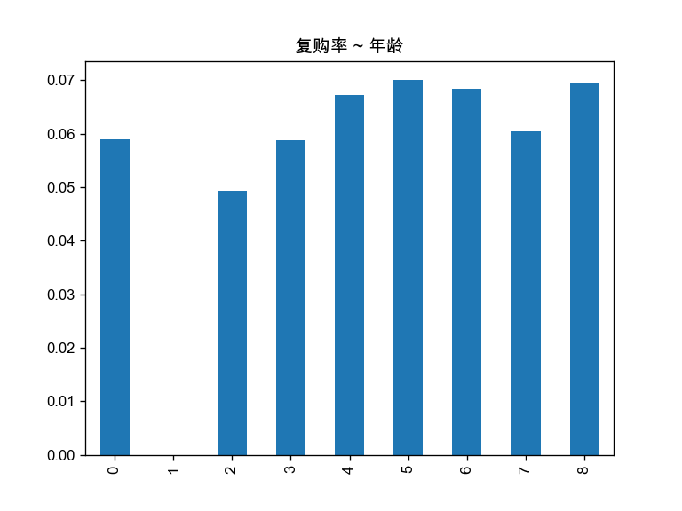
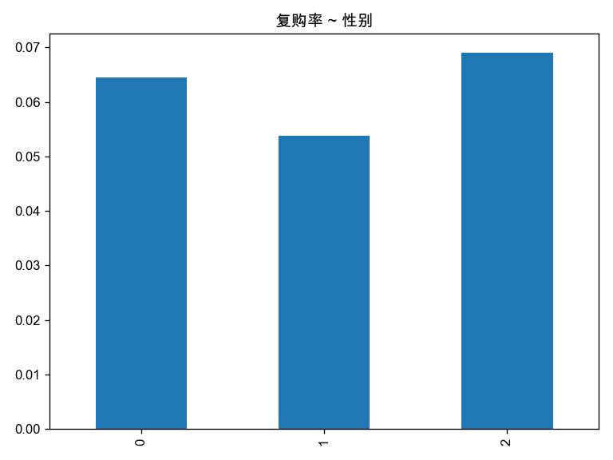
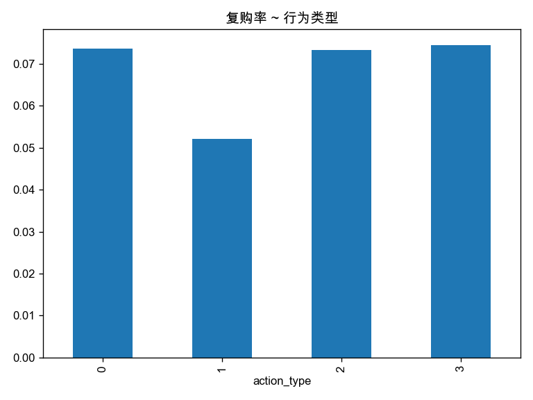
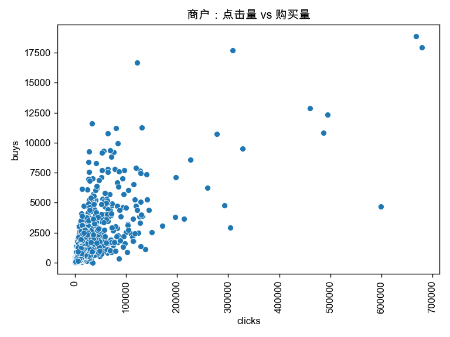

# 天猫复购预测 (Tmall Repurchase Prediction)

## 项目简介

本项目是基于阿里天池大数据竞赛的**天猫复购预测学习赛**的机器学习解决方案。项目旨在根据商家和消费者的相关信息，预测给定的新消费者在未来6个月内是否会再次从同一商家购买商品，帮助商家识别潜在的忠实客户，降低促销成本，提高投资回报率。

## 🎯 项目背景

商家经常在特定日期（如双十一、黑色星期五等）开展大型促销活动吸引消费者，但很多被吸引来的买家都是一次性消费者。为了帮助商家识别出可以转化为重复购买者的消费者，本项目通过分析用户行为数据，构建预测模型来预测消费者的复购概率。

## 📊 数据集说明

数据集包含了匿名用户在"双十一"前6个月和"双十一"当天的购物记录，标签为是否是重复购买者。出于隐私保护，数据采样存在部分偏差。

### 数据文件结构
```
user_log_format1.csv     # 用户行为日志
user_info_format1.csv    # 用户画像信息  
train_format1.csv        # 训练数据
test_format1.csv         # 测试数据
```

### 数据字段说明

**用户行为日志 (user_log_format1.csv)**
- `user_id`: 购物者的唯一ID编码
- `item_id`: 商品的唯一编码
- `cat_id`: 商品所属品类的唯一编码
- `merchant_id`: 商家的唯一ID编码
- `brand_id`: 商品品牌的唯一编码
- `time_tamp`: 购买时间（格式：mmdd）
- `action_type`: 用户行为类型 {0: 点击, 1: 加入购物车, 2: 购买, 3: 添加到收藏夹}

**用户画像 (user_info_format1.csv)**
- `user_id`: 购物者的唯一ID编码
- `age_range`: 用户年龄范围（1: <18岁, 2: [18,24], 3: [25,29], 4: [30,34], 5: [35,39], 6: [40,49], 7&8: ≥50, 0/NULL: 未知）
- `gender`: 用户性别（0: 女性, 1: 男性, 2/NULL: 未知）

**训练/测试数据 (train_format1.csv / test_format1.csv)**
- `user_id`: 购物者的唯一ID编码
- `merchant_id`: 商家的唯一ID编码
- `label`: 是否为重复买家（训练集: 0-非重复, 1-重复；测试集: 需要预测）

## 🛠️ 技术架构

### 1. 数据预处理
- 数据清洗和缺失值处理
- 特征提取和构造
- 数据标准化和归一化

### 2. 特征工程
- **统计特征**: 用户-商家交互次数、购买频率、行为统计等
- **时序特征**: 双十一期间的行为模式、时间跨度等
- **用户特征**: 年龄、性别等画像信息
- **商家特征**: 商家活跃度、用户群体特征等

### 3. 数据可视化










### 4. 模型选择与训练
本项目选择catboost模型

### 5. 模型评估
精确率接近0.65


### 安装依赖
```bash
pip install -r requirements.txt
```
